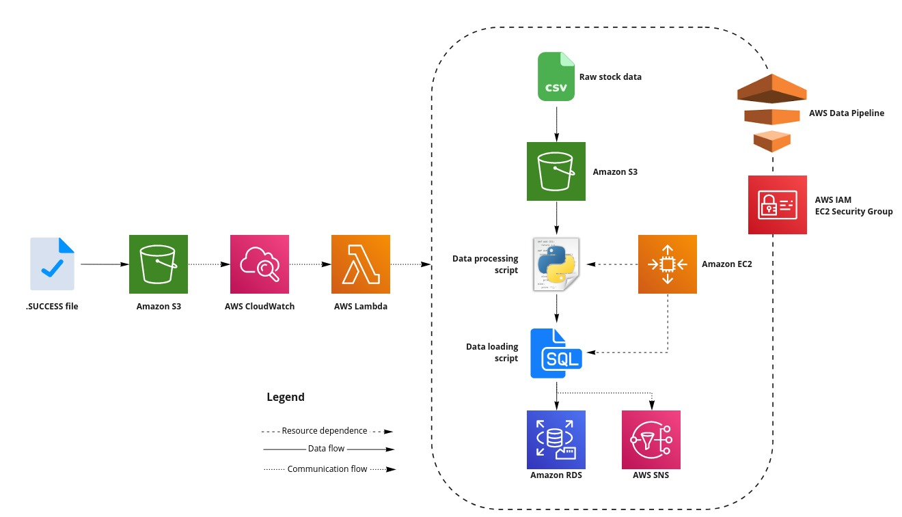
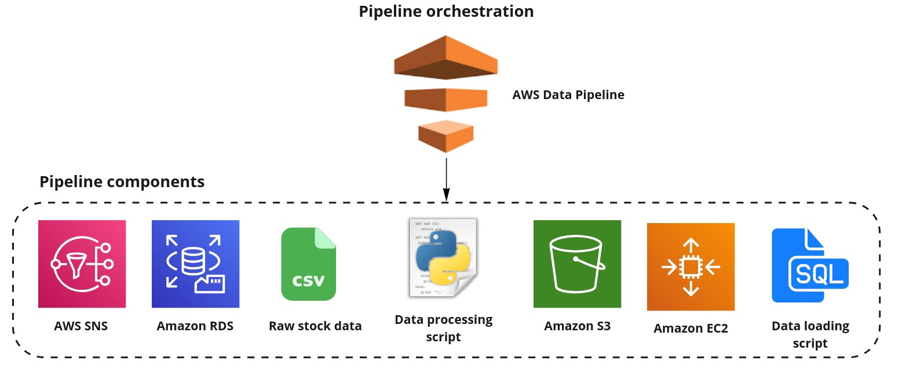
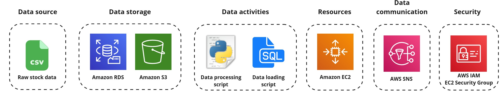
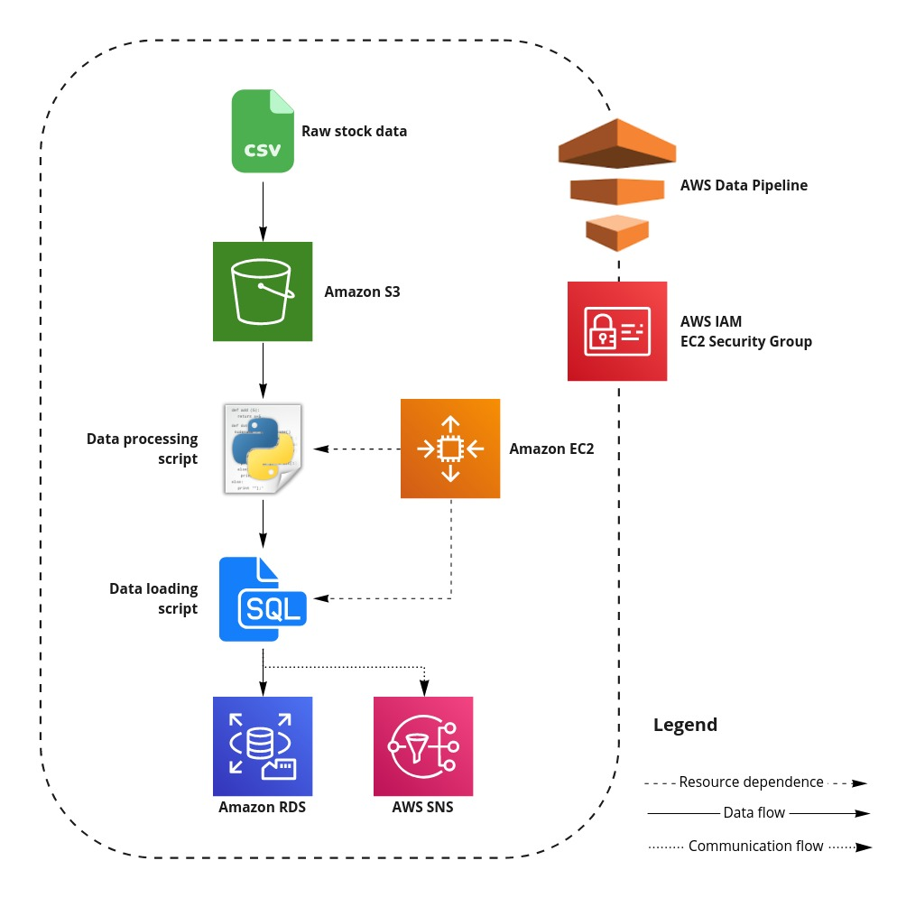

# EVENT BASED ETL WITH AWS LAMBDA CONTAINER IMAGE
Data2bots Technical assessment


#### Table of contents 

   - [Table of contents](#table-of-contents)
  - [overview](#overview)
    - [Functional requirements of the data pipeline](#functional-requirements-of-the-data-pipeline)
  - [Part-I: Configure pipeline layers](#part-i-configure-pipeline-layers)
    - [Component overview](#component-overview)
    - [Pipeline layers](#pipeline-layers)
      - [Security](#security)
      - [Data source](#data-source)
      - [Data storage](#data-storage)
    - [Create an event-based lambda](#create-an-event-based-lambda)

## Overview
[Back to top](#table-of-contents)

<p align='center'>
     
     <br>
     <em>Figure 1: A representation of the completed pipeline.</em>
</p>

As part of this migration, raw data, given in the form of orders, reviews, and shipments `csv` snapshot batches gathered by the on-premise application, needs to be moved to the datawarehouse and analyzed. As an initial effort in this movement of data, ABC company have homed in on the trading data of thousands of records over the past seven years, and will only require a subset of the raw data to be migrated and analyzed to the cloud in a batch-wise manner.  

With the above requirements, my role as a data engineer is to create a robust data pipeline that can extract, transform, and load the `csv` datasets from the source data system to a SQL-based database. The final pipeline will be built in [AWS Data Pipeline](https://aws.amazon.com/datapipeline/) and would utilise AWS services as its functional components. 

### Functional requirements of the data pipeline
[Back to top](#table-of-contents)

At its completion, the formed data pipeline exhibits the following functionality: 

 - **Pipeline input:** The pipeline is capable of *ingesting and processing 3 `csv` files* per workflow run.
 - **Pipeline output:** The raw data is *stored within a PostgreSQL staging DB schema * and the resulting processed data in a postgreSQL analytics DB schema.   
 - **Monitoring:** The pipeline provides an *email-based success or failure notification* following an attempted run.  
 - **Automation:** The pipeline is *event-driven*, triggering upon a file change in a monitored Amazon S3 bucket. The pipeline will not be invoked more than once per day. 
 - **Scaling:** There are no scaling requirements for the pipeline, and there is no need to make assumptions about concurrent runs or the size of the input batch increasing. 


## Part-I: Configure pipeline layers 

### Component overview
[Back to top](#table-of-contents)

<p align='center'>
     
     <br>
     <em>Figure 2: The individual components utilised within the formed data pipeline.</em>
</p>

*Table 1* below describes the components used to form the data pipeline. These components are also displayed for convenience in *Figure 2*. 

**Table 1: Data pipeline components**

| Component name | Description |
| :------------  | :---------- | 
| Raw transaction data | Provided as `.csv` files for shipments, reviews, and orders transactions. This data will be extracted, processed, and loaded into a relational database as part of the formed data pipeline. | 
| Amazon S3      | Data lake for raw and processed data. Also considered as a target for logging information produced by AWS Data Pipeline during the pipeline runs.  |
| Amazon EC2     | A `t2.micro` instance providing the compute necessary for data processing within the data pipeline.  | 
| Processing script | A Python file describing the processing operations to be performed on the data. |
| Amazon RDS | A  PostgreSQL database used as the target data system for the raw and analyzed data within the pipeline. | 
| SQL query | Embedded in the python file for data transformation | 
| Amazon SNS | Produces a notification (via email) of the pipeline's run status (success or fail).|
 

### Pipeline layers
[Back to top](#table-of-contents)

<p align='center'>
     
     <br>
     <em>Figure 3: Data pipeline layers interaction.</em>
</p>


#### Security


   | Type | Protocol | Port Range | Source | 
   | ---- | -------- | ---------- | ------ |
   | PostgreSQL | given | given | given | 
   | SSH | TCP | 22 | My IP  | 

   <br>
      
   | Policies | Trust Relationships |
   | -------- | ------------------- |
   | AmazonS3FullAccess         | |
   | AmazonEC2FullAccess        | elasticmapreduce.amazonaws.com|
      


#### Data source 
The stock data required for the predict is currently located in a public s3 bucket.
 
#### Data storage 


    ```

   . Upload the source `.csv` files to PostgreSQL

 
#### Resources
 - **Amazon EC2 instance**

   <br>

    | EC2 Instance Property | Value | 
    | :-------------------- | :---- | 
    | AMI       | Amazon Linux 2 (HVM) | 
    | Instance type           | `t2.micro` |
    | VPC                   | default |  
    | Storage                   | 8GB SSD Volume |  


   - Instance dependencies:
      
         1. **Anaconda**  to have a Python environment;

         2. **Pandas** to perform the required data manipulation; and

         3. **AWS Command Line Interface (CLI)**

         4. boto3

         5. Numpy

         6. Psycopg2

         7. csv
            


 - **Mount S3 data source**


   1. Made use of the **S3FS Fuse** filesystem application to mount the source S3 bucket to my EC2 instance.
 

#### Data activities
 - **Extract source data with Python**
 - **Create tables in the staging and analytics schemas**
 - **Load source data into postgreSQL with Python**
 - **Create weird dates on NaN shipment dates columns in the pandas dataframe to gain entry into the corresponding table in postgreSQL**
 - **Replace weird dates with Null in the SQL database using SQL**
 - **Run analysis of the dataset with SQL**
 - **Convert analysis results into dataframe and load to Analytics schema in PostgreSQL with Python**
 - **Upload results of analysis into s3 bucket as csv**


#### Data communication
   An important aspect of any pipeline is its observability. To enable the monitoring of the data pipeline, notifications have been created to produce alerts when the pipeline runs – resulting in either a success or failure notification. These notifications are communicated via email.
 

## Part-II: Pipeline assembly 
[Back to top](#table-of-contents)

At this point, all the pipeline components and layers required to build your data pipeline should be ready. However, this is only half of the job done. You still need to utilise the individual components to create an AWS Data Pipeline.

<p align='center'>
     
     <br>
     <em>Figure 4: The pipeline design utilising all previously configured layers.</em>
</p>


## Part-III: Pipeline automation  
[Back to top](#table-of-contents)

<p align='center'>
     
     <br>
     <em> Figure 5. The final pipeline, formed through the addition of event-based automation.</em>
</p>

THe pipeline automation is triggered upon a file drop event within a monitored folder.


### Create an event-based lambda
[Back to top](#table-of-contents)

To operate efficiently, the process to trigger the pipeline has been set up to be serverless through AWS Lambda. As such, an initial step is to instantiate an event-based lambda that will use the pipeline definition to spin up a new version whenever invoked.

  - Briefly, this code performs the following actions when a change is detected within the monitored S3 bucket: 
     1. Initially, a scan is made of deployed Data Pipeline instances to determine if the data pipeline has been run before.
     2. **Any previous runs detected are deleted (this is a cost-saving action).**
     3. **A new empty pipeline definition is created.**
     4. **The definition of the final data pipeline is fetched from the source S3 bucket.**
     5. We decode this JSON-based definition into a structure parsable by the Data Pipeline API. 
     6. Using this decoded definition, we automatically populate the empty pipeline with the necessary components to run successfully. 
     7. The pipeline is activated, initiating a workflow run.
         
         
         <br>
The following is a checklist of all components associated with this project: 

 - [ ] AWS Data Pipeline instance
 - [ ] Event-based lambda function
 - [ ] Event-based lambda function IAM role
 - [ ] Event-based S3 bucket
 - [ ] Data pipeline EC2 AMI
 - [ ] Source S3 bucket 
 - [ ] Pipeline-based SNS topics and subscriptions
