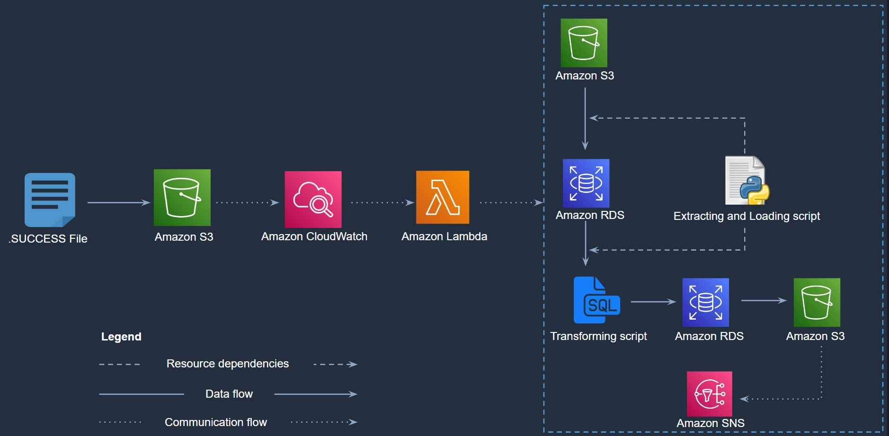

# EVENT BASED ETL WITH AWS LAMBDA CONTAINER IMAGE
Data2bots Technical assessment

#### Table of contents 

   - [Table of contents](#table-of-contents)
  - [overview](#overview)
    - [Functional requirements of the data pipeline](#functional-requirements-of-the-data-pipeline)
  - [Why containerized lambda?](#why-containerized-lambda)
  - [Components and Pricing](#Components-and-Pricing)
  - [The ETL process](#The-ETL-process)
      - [Loading the data](#Loading-the-data)
      - [Transforming the data](#Transforming-the-data)
      - [Automation](#automation)
  - [Checklist](#Loading-the-data)

## Overview
[Back to top](#table-of-contents)

     
      
     <em>Figure 1: A representation of the completed pipeline.</em>

Raw data, given in the form of orders, reviews, and shipments `csv` snapshots gathered by my client. requires to be moved to the data warehouse and analyzed. As an initial effort in this movement of data, ABC company has homed in on the transactional data of thousands of records over the past seven years and requires them to be migrated and analyzed to the cloud in an automated manner.  

With the above requirements, my role as the sole data engineer is to create a robust data pipeline that can extract, transform, and load the `csv` datasets from the source data system to a SQL-based database, saving a back up of the analytics details as CSV in a data lake.

### Functional requirements of the data pipeline
[Back to top](#table-of-contents)

The formed data pipeline exhibits the following functionality: 

 - **Pipeline input:** The pipeline is capable of *ingesting and processing 3 `csv` files* per workflow run.
 - **Pipeline output:** The raw data is *stored within a PostgreSQL staging DB schema * and the resulting processed data in a postgreSQL analytics DB schema.   
 - **Monitoring:** The pipeline provides an *email-based success or failure notification* following an attempted run.  
 - **Automation:** The pipeline is *event-driven*, triggering upon a file change. The pipeline will not be invoked more than once per day. 

## Why containerized lambda?
[Back to top](#table-of-contents)

The decision of my ETL pipeline components and processes are based these major considerations:
- ABC company would be recieving data from transactional activities on daily basis. The flux of these activities cannot be forecasted by an exact number of, for example: expected orders in a day/week/month, hence the project has to be considered as a memory intensive workload.
- ABC requires analytics report mostly on a yearly reporting period.
- The data is expected to rapidly grow considering the expanding plans the company would have.
- All online activities are free

Based on these considerations, ABC data pipeline would require a rapid scaling, high availability, and secured process that is triggered upon a file change in a monitored Amazon S3 bucket to extract and transform their data in a very cost effective manner.

Lambda serverless computing offers this and more, with a highly effective autoscaling capability (from 0 to 3,000 concurrent executions in seconds) and a unique billing process that's based on just what is used and scales itself to zero when it is not used.
The container image bolsters the agility of the lambda function by being able to accomodate larger lambda functions with a 10GB package deployment size compared to 50mb zip deployment if using just Lambda.

## Components and pricing
[Back to top](#table-of-contents)

    

 | Major components | Appx cost | 
 | :--------------- | :---------| 
 | AWS ECR       | $0.10/GB/Month | 
 | AWS SNS           |$2/100k notifications |
 | AWS Cloudwatch                   | $0.30/10k metrics/month|  
 | AWS Lambda                   |$0.0000063/day|  

## The ETL process
[Back to top](#table-of-contents)

### Loading the data
All data loading was done with with Python, using boto3 to connect to the S3 bucket

### Transforming the data
All transformation was done in SQL, then converted to a dataframe through Python to enable ease loading into their respective PostgreSQL tables

### Automation
Based on the analytics requirements which spans through a yearly calendar or based on a specific timeline, it is therefore recommended that the pipeline should run in a batch-wise manner upon a file change in s3 bucket. Hence whenever a .SUCCESS (emphasis on the casing) file is introduced, lambda function is invoked to run the ETL functions. This would usually take less than 2 minutes to complete.

### Challenges
- DataType errors:
      Null values in SQL are represented by the DataType `Null`, however, pandas converts this to 'NaN', a datatype not recognized by postgreSQL, hence 
      While loading `shipment_deliveries` data into the postgresQL table it resulted into an error due 'Nan' values in the expected empty cells, the `NaN` value was       percieved as a string in SQL which made it alien to the date DataType declared in the `delivery_date` and `shipment_date` columns.
      
   This was resolved by substituting the `NaN` values in the dataframe with a 'weird' date (`1000-01-01`), then using SQL to replace them into `Null` values while      in the SQL table.
   
- Lambda function:
      I chose Lambda function and event trigger with SNS to be the major components of the pipeline in other to make a robust, yet simple cost effective, however, the dependencies for the function to run efficiently was above lambda's limit by 200mb, hence I resulted into using a lambda container image process to build the pipeline.
      
 
 
## Checklist
[Back to top](#table-of-contents)

The following is a checklist of all components associated with this project: 

 - [ ] Lambda function
 - [ ] Amazon ECR
 - [ ] Amazon Cloudwatch
 - [ ] Amazon SNS
 - [ ] Docker
 - [ ] EC2 - to setup my Docker environment in Ubuntu
 - [ ] AWS CLI     

